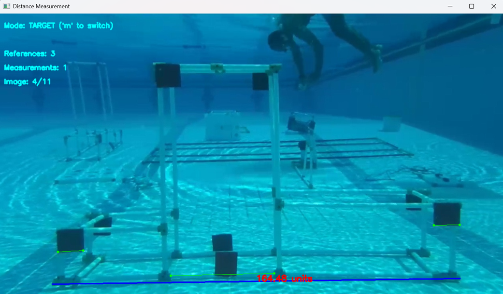

# Monocular Image Distance Measurement Tool




## Short Description

A calibrated monocular image-measurement tool for estimating real-world distances from reference objects in still images. Built for underwater coral gardens and iceberg analysis, it supports multi-reference averaging, zooming, folder navigation, and manual target measurements.

## Overview

This project is an interactive image-based distance measurement tool built with Python and OpenCV. It allows the user to estimate real-world distances in still images by defining one or more reference distances, then using the calculated pixel-to-real-world scale to measure target objects in the same image plane.

The tool was developed for visual measurement scenarios such as underwater coral garden assessment and iceberg image measurement, where direct physical measurement can be difficult, unsafe, or impractical.

It is designed for cases where a depth sensor, stereo camera, or LiDAR system is not available. Instead of relying on depth data, the program uses manually selected reference objects of known length to estimate distances from a single image.

## Purpose

The main goal of this tool is to support manual measurement from images when only a monocular camera is available.

Typical use cases include:

- Measuring coral growth, spacing, or structure dimensions in underwater imagery.
- Estimating iceberg features from captured images.
- Measuring objects on a known plane when a real-world reference is visible.
- Performing quick visual analysis where full 3D reconstruction is not available.
- Comparing distances across multiple images from the same folder.

## Important Measurement Assumptions

This tool does not perform true 3D measurement. It estimates distances from 2D image data using reference scaling. For accurate results, the following conditions are important.

### 1. Camera Calibration Is Recommended

If you are using a normal single camera without a depth sensor or stereo vision, camera calibration is strongly recommended.

Camera calibration helps correct lens distortion, especially radial and tangential distortion caused by wide-angle lenses, action cameras, underwater housings, or low-cost camera modules. Distorted frames can produce inaccurate pixel distances, especially near the image edges.

For more reliable results, calibrate the camera before measurement and undistort the images before using this tool.

### 2. Camera Should Be Perpendicular to the Measurement Plane

The camera should be as perpendicular as possible to the plane of the object being measured.

If the camera is tilted relative to the object plane, perspective distortion will affect the measurement. Objects farther from the camera will appear smaller, and objects closer to the camera will appear larger, even if their real-world dimensions are the same.

This tool works best when the measured object and the reference object lie on the same flat or approximately flat plane.

### 3. Reference and Target Should Be at the Same Depth

The reference object should be located at the same depth as the target object or the variable length you want to measure.

For example, if you are measuring a coral branch, the reference scale should be taken from a known object, ruler, or marker located on the same depth plane as that coral branch. If the reference is closer or farther from the camera than the target, the resulting scale will be incorrect.

### 4. Multiple References Improve Accuracy

The program supports multiple reference measurements. Taking several reference pairs is recommended because it improves the average scale and reduces the effect of manual clicking errors, lens distortion, local perspective variation, and distorted frames.

Instead of relying on one reference line, the tool calculates an average scale from all selected reference pairs.

## How It Works

The program calculates the Euclidean pixel distance between two clicked points.

For reference measurements:

```text
scale = real_world_distance / pixel_distance
```

For target measurements:

```text
estimated_distance = target_pixel_distance × average_scale
```

When multiple references are added, the program averages their scale values and uses the average scale for target measurements.

This approach is simple, transparent, and useful for controlled image-measurement scenarios, but it depends heavily on correct image geometry, camera calibration, reference placement, and point selection accuracy.

## Features

### Manual Reference-Based Scaling

The user can select two points on a known reference object and enter its real-world distance. The program then calculates the conversion scale between pixels and real-world units.

### Multiple Reference Averaging

The tool allows several reference pairs to be added. Each reference contributes to the final average scale, improving measurement reliability and reducing the effect of a single inaccurate reference.

### Target Measurement Mode

After defining one or more references, the user can switch to measurement mode and click two points on a target object. The software estimates the real-world distance using the current average scale.

### Interactive Zoom

The program includes interactive zoom controls to improve point selection precision.

Supported zoom controls include:

- Mouse wheel zoom.
- Double-click zoom toward a selected region.
- Keyboard zoom using `+` and `-`.
- Reset zoom using `r`.

### Folder-Based Image Navigation

When one image is selected, the program automatically loads all supported images from the same folder. This allows quick navigation through related image datasets without repeatedly opening files manually.

Supported image formats include:

- `.jpg`
- `.jpeg`
- `.png`
- `.bmp`
- `.tiff`
- `.webp`

### Context-Aware Undo

The `c` key performs context-aware undo:

- If a point pair is unfinished, it removes the last clicked point.
- In reference mode, it removes the last reference pair and updates the average scale.
- In target mode, it removes the last measured target line.

### Measurement Reset

The program allows the user to reset all references and measurements without restarting the application.

### Visual Overlays

The interface displays:

- Reference lines.
- Pending clicked points.
- Measured target lines.
- Estimated real-world distances.
- Current mode.
- Number of references.
- Number of measurements.
- Current image index.

## Controls

| Key / Action | Function |
|---|---|
| Left mouse click | Select measurement points |
| Mouse wheel | Zoom in or out toward cursor |
| Double-click | Zoom into selected area |
| `m` | Switch between reference mode and target measurement mode |
| `c` | Undo last point, reference, or measurement |
| `+` / `=` | Zoom in |
| `-` / `_` | Zoom out |
| `r` | Reset zoom |
| `x` | Reset all references and measurements |
| Left arrow | Previous image in folder |
| Right arrow | Next image in folder |
| `q` or `Esc` | Exit |

## Installation

Clone the repository:

```bash
git clone https://github.com/your-username/your-repository-name.git
cd your-repository-name
```

Install the required Python package:

```bash
pip install opencv-python
```

Tkinter is also required for the file selection dialog. It is included with many Python installations. On some Linux systems, it may need to be installed separately:

```bash
sudo apt-get install python3-tk
```

## Usage

Run the script:

```bash
python distance_measurement.py
```